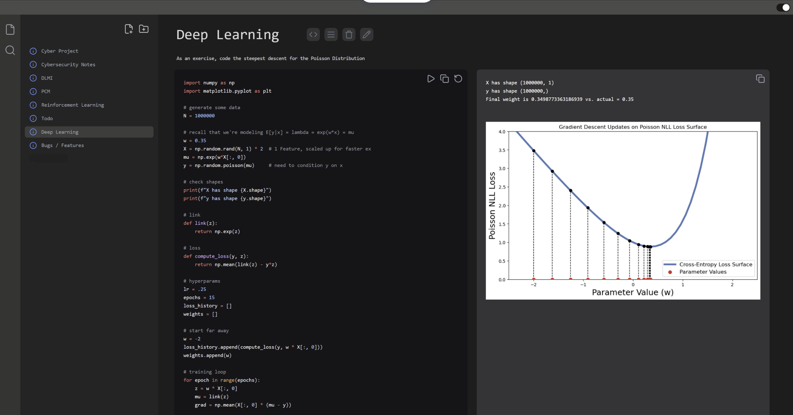

# Kernel


**Kernel** is a customizable desktop notebook that sits somewhere between VsCode editor and jupyter notebook. Built this because I don't like notion's color scheme and VsCode is great but not for notes.
I love notion, but the color scheme and font aren't as nice as the github dark plugins you can get on VsCode. 

<p align="center">
  
</p>

---

## Getting Started

### Prereqs
- **Node.js** (LTS recommended)
- **pnpm**
- **Python 3.10+** (for the execution layer)

### Install

Clone the repo and install dependencies in both the backend and frontend.

```bash
# backend
cd api
pnpm install

# frontend
cd ../web
pnpm install
```

Additionally, rename the .env.example file to .env in the web directory. 
```bash
cd web
cp .env.example .env
```

## Backend Setup (Database + Migrations)
```bash
cd api/src/db
touch app.db     # or on a windows machine, just create a new file called app.db

# to initialize the database
cd api
pnpm db:init
```


## Running the Application
```bash
# backend
cd api
pnpm start          # in terminal 1

# frontend
cd web
pnpm dev            # in terminal 2
pnpm electron       # in terminal 3
```
---
